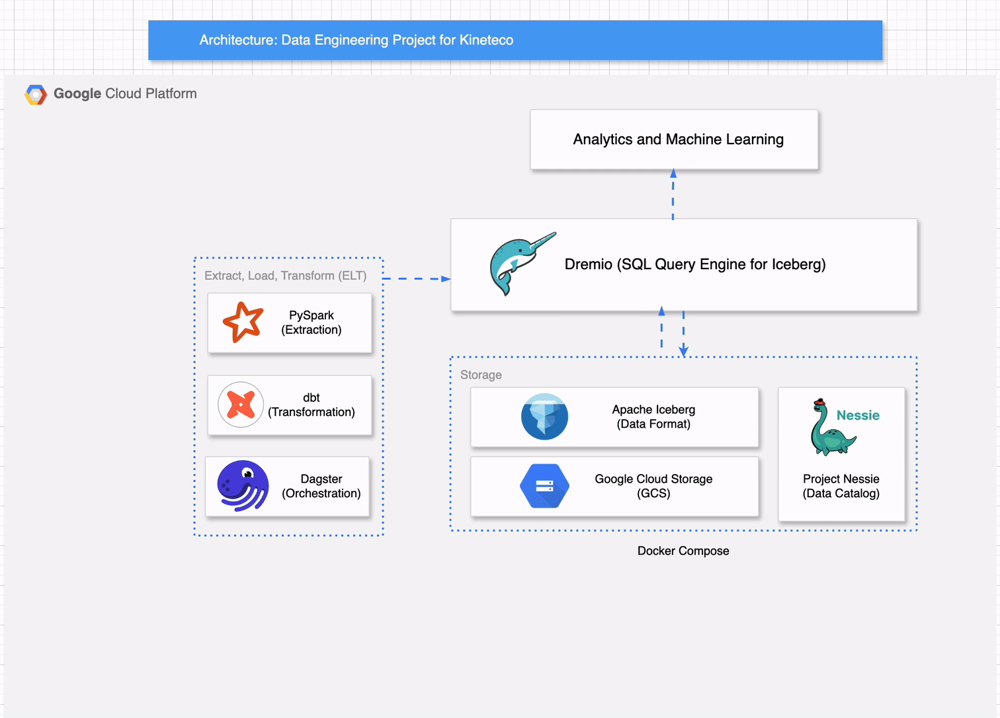

# 🛠️ Production-Ready Data Engineering Pipeline with Generative AI Integration
[](https://cloud.google.com/)
[](https://cloud.google.com/storage)
[](https://www.python.org/)
[](https://spark.apache.org/)
[](https://www.getdbt.com/)
[](https://www.docker.com/)
[](https://www.dremio.com/)
[](https://projectnessie.org/)
[](https://dagster.io/)
[](https://jupyter.org/)
[](https://superset.apache.org/)
[](https://streamlit.io/)
[]()

A production-grade Data Engineering pipeline that integrates Spark for data migration, dbt for transformation, and Dagster for orchestration. The processed data powers an analytics dashboard in Apache Superset and a Generative AI interface via RAG + LLM using Streamlit. Designed to simulate an EV product data workflow in a modern lakehouse architecture.

> ✅ Designed as a **portfolio project for Data Engineer roles**, integrating batch processing, modeling, BI reporting, and AI-based interaction.

## 🚀 Project Overview

> 🚗 **Use case:** Help sales & operations teams explore EV product configurations, color options, and sales trends via a conversational interface.

This project delivers a **production-grade data engineering pipeline** designed for real-time analytics and AI-driven exploration of electric vehicle (EV) sales data. It integrates modern data tooling and large language models (LLMs) to create a seamless, interactive experience for business users.

### 🔧 Key Highlights

- 🚀 **Data Ingestion** using PySpark and Google Cloud Storage (GCS)
- 🧱 **Data Transformation & Modeling** with dbt, orchestrated by Dagster
- 🔍 **Query Layer** powered by **Dremio** (SQL over data lake, no warehouse needed)
- 📊 **BI Layer** built using **Apache Superset** for sales dashboards
- 🧠 **Retrieval-Augmented Generation (RAG)** using **ChromaDB** + **Ollama (Mistral)** for smart QA
- 💬 **Interactive UI** via **Streamlit** chatbot
- 🐳 **Fully containerized** with Docker and served securely via Ngrok

### ❓ Example Chat Queries

- "What EV color sold best in Q1 2024?"
- "Show me the sales breakdown for the AeroFlow model by region"
- "List all available models with more than 500km range"

---

## 🗺️ Architecture Diagram

- **Spark ingestion from CSV/JSON into MinIO**
- **dbt DAGs running on Dagster**
- **Dremio as semantic + acceleration layer**
- **Superset for analytics**
- **ChromaDB for vector storage**
- **LLM with Ollama (Mistral)**
- **Chatbot interface via Streamlit**



## 🧰 Tech Stack

| Layer                | Tools & Frameworks                                                                 |
|---------------------|-------------------------------------------------------------------------------------|
| **Data Ingestion**   | [Apache Spark (PySpark)](https://spark.apache.org/) + [GCS](https://min.io/) (Google Cloud Storage) |
| **Data Transformation** | [dbt](https://www.getdbt.com/) (data modeling), [Dagster](https://dagster.io/) (orchestration) |
| **Data Warehouse**   | [DuckDB](https://duckdb.org/) (local OLAP engine) — pluggable with Redshift / Snowflake |
| **Data Visualization** | [Apache Superset](https://superset.apache.org/) (interactive dashboards & reporting) |
| **Notebook Interface** | [Jupyter](https://jupyter.org/) (development & debugging support)                     |
| **LLM Embedding Store** | [Chroma](https://www.trychroma.com/) (local vector database)                        |
| **LLM Backend**      | [Ollama](https://ollama.com/) + [Mistral](https://mistral.ai/) + [nomic-embed-text](https://huggingface.co/nomic-ai) |
| **Frontend / UI**    | [Streamlit](https://streamlit.io/) chatbot interface (user Q&A with RAG pipeline) |
| **Dev & Ops Tools**  | [Docker](https://www.docker.com/), [Ngrok](https://ngrok.com/), Python, `dotenv`, logging |

---

> 💡 *All components are modular and containerized — easily portable for deployment or extension.*

## 📊 Data Pipeline Walkthrough

### 1. 🔁 Data Migration with Spark

- Used **PySpark** to extract, clean, and load raw sales data into a lakehouse.
- Integrated with **GCS** as a Cloud DataLake.

```bash
# Sample code snippet
df = spark.read.csv("s3a://lakehouse/sales.csv", header=True)
df.write.parquet("s3a://lakehouse/processed/")
```


### 2. 🧱 Data Modeling with dbt
* Created models for products, sales_summary, and color_distribution.
* Scheduled and tested transformations locally.
```sql
-- Example dbt model
SELECT 
    model,
    color,
    COUNT(*) AS sales_count
FROM {{ ref('sales') }}
GROUP BY 1, 2

```


### 3. 📈 Interactive Customer Insights Dashboard with Apache Superset

Developed an interactive dashboard to analyze key customer segmentation metrics, including:
* VIP customer distribution by state to identify high-value regions
* Customer model preferences by location across six product lines
* Overall VIP ratio analysis, highlighting customer loyalty and engagement patterns

This dashboard provides actionable insights for regional marketing strategies and product optimization, with visualizations powered by Apache Superset.


### 4. 🧠 EV Product Chatbot Interface — Powered by Generative AI

Built an interactive chatbot application using a local LLM interface (deployed via localhost:8501) to simulate customer service for an electric vehicle (EV) company. The chatbot is capable of:
* Answering context-aware product queries, such as best EV models for city driving or feature comparisons across models.
* Providing dynamic responses about color availability, performance specs, and design features for multiple EV models (e.g., AeroFlow, UrbanGlide, EcoSprint).
* Delivering natural language explanations drawn from embedded documentation (PDF/Markdown) using RAG (Retrieval-Augmented Generation).

📸 Screenshot shows real-time chat interactions where users inquire about model suitability, color availability, and detailed specifications.


## 🎯 Skills Demonstrated
* ✅ GCS for large-scale datalake
* ✅ PySpark for large-scale transformation
* ✅ dbt for data modeling & CI-friendly pipelines
* ✅ Superset for rapid BI development
* ✅ LLM apps using LangChain + Ollama + Chroma
* ✅ Streamlit for frontend chatbot UI
* ✅ Environment control with .env, pyenv, ngrok

## 📁 Repository Structure
<pre><code>Sales-Copilot-Lakehouse/
├── rag/                    # LLM, RAG, Chatbot code
│   ├── manage_chroma_db.py
│   ├── streamlit_chat.py
├── dbt/                    # dbt models and config
│   ├── models/
│   ├── dbt_project.yml
├── spark_jobs/            # PySpark scripts for ingestion
├── superset/              # Superset dashboard exports
├── chroma/                # Persisted vector DB
├── images/                # 📷 Screenshot placeholders
├── .env                   # Environment secrets
└── README.md              # You're here
</code></pre>